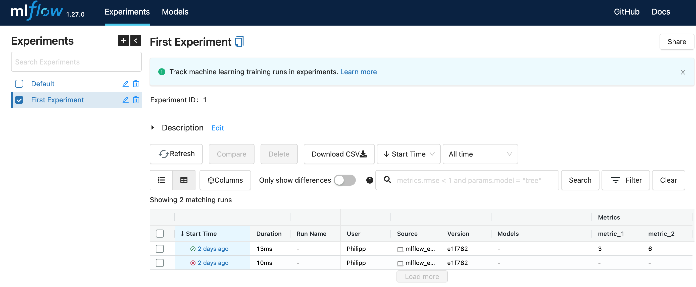
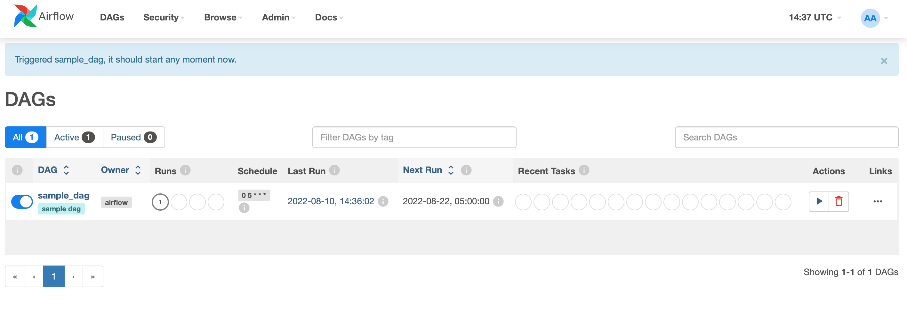

# Introduction to Airflow and MLFlow for Machine Learning

Hi! In this short tutorial I would like to show you two awesome tools that help make your Machine Learning projects a lot more efficient and effective. If you read the title, you probably already know that those two tools are Airflow and MLFlow. However, you might not really know what they do. So, in order to give you a basic idea, let me give you two examples.


## Quick overview of MLFlow

### What is MLFlow?

MLFlow is an open-source tool that helps you during the entire life cycle of your Machine Learning process.

The quickest and easiest to implement way to use MLFlow is by tracking and record experiments. Imagine you try out a few models - maybe an XGBoost and a Neural Network - and test each of these with a few different parameters. It is very easy to forget which combination produced the best results. MLFlow though lets you store your models, together with parameters and relevant metrics so you can always go back and compare models. If you run your model over a longer period of time, this can also help you to detect model drift.



But that's not all! You can also store your models to share with your colleagues.

Finally, MLFlow helps you to stage your models, deploy them or put them in production.


### Getting started with MLFlow

We are going to run everything python related in a conda environment. In case you don't know anaconda or haven't thought about using it, I can highly recommend [doing so](https://docs.anaconda.com/anaconda/install/). If you have ananconda installed create an environment, activate it and install mlflow with

```
conda create -n "airflow_mlflow" python=3.10

conda activate airflow_mlflow

pip install mlflow
````

You can obviously find a more creative name for the environment if you like. Easy right? Well that is almost everything you need to get started. 


### Minimal Example

To test it, you can run the sample file *first_test.py* to store the metrics and parameters, then type *mlflow ui* in your terminal (the conda environment needs to be activated as well) and copy the link that is shown. In my case, I accessed the UI via *http://localhost:5000*.

By looking at the code, you can already see how it works. The metrics (things like accuracy) and parameters (things like number of neurons in a layer of your Neural Network) are stored in the respective columns. This shows quite well, how you can trace back which parameters gave you the best results. Finally, you can also store an artifact, in this case a simple *.txt* file.

*Note: Your runs and experiments are stored in the folder mlruns. In order to find those in the user interface, make sure you run **mlflow ui** in the directory **mlflow**.*

## Quick overview of Airflow

### What is Airflow?

The processes in every company can get pretty complicated so the workflows in your projects can become quite overwhelming. Whether it's loading the data from differenct sources, pre-processing it, training the model, passing necessary tests etc., most processes have to follow a strict order and not doing this might lead to bad results. To not lose track of these steps and to automate the entire pipeline, airbnb developed [Airflow](https://airflow.apache.org). 

In Airflow you design so-called directed acyclic graphs - or DAGs. These graphs describe the dependencies of each step in your project. For example, if you don't have the data, you cannot train your model or if you don't pass important tests, you cannot deploy it. Airflow allows you to design these DAGs in a way that the model won't be trained if the data import fails, similar to the deployment that is stopped if the tests fail. The big advantage of Airflow is that it simplifies these steps enourmously while having a useful interface.


### Getting started with Airflow

There are a few different ways to get started with Airflow. In this quick tutorial we are going to use Airflow from a Docker container. First, you need to install [Docker](https://docs.docker.com/get-docker/) and docker-compose. The latter should be installed together with Docker. Airflow needs a few different components, so we need to get start the container with docker-compose instead of simply docker. However, the good news is that the Airflow community has created a **docker-compose.yaml**-file that comes in really handy. This file can be found in the folder **airflow** but if case you want the newest version, run the following commands in your project folder:

```
mkdir airflow

cd airflow

curl -Lf0 'https://airflow.apache.org/docs/apache-airflow/stable/docker-compose.yaml' > docker-compose.yaml
```

If you have some experience with Docker, you can go through the file and get familiar with the content. If not, no worries, I'll tell you what you need to do! 

In short, the first part describes how the Airflow part of the container is created, such as the location of the dags (a little bit more on that later) and the dependencies. Under **services** we define all the components that are part of the infrastructure. We mainly need a database (here we use postgres) and a communication service (which will be redis). In terms of Airflow-specific components, we need a scheduler which schedules our tasks and a webservice. The rest of the docker-compose makes our lives easier as well, the airflow-init part, for example, initializes the service. 

Now, we need to create the folders defined in line 63-65. Those are then mounted onto the container, so whatever content there is in these folders will be accessible inside the container as well. Inside the folder **airflow** run

```
mkdir dags logs plugins
```
You also need to set the permissions and save them in a file called **env** with the following command:

```
echo -e "AIRFLOW_UID=$(id -u)\nAIRFLOWGID=0" env
```

Okay, we are all set! That wasn't too hard, was it? Now, to initialize the airflow container, we need to run the

```
docker-compose up airflow-init
```

and wait a little bit. This command initializes Airflow with the user *airflow* and password *airflow*. If you want to use it in your company, this user is not recommended for obvious reasons. You can change this in lines 236 and 237 of the **docker-compose**. Then run

```
docker-compose up
```

which starts all the services defined in the docker-compose and your container should be up and running! You can access the webservice with the url "http://localhost/8080". Port 8080 is default for Airflow. If you want to use a different one, you can change it in lines 104 and 106.

*Note: One of the errors that you can run into is the WorkerLostError('Could not start worker processes',). I solved this by assigning more memory to the Docker container. This can be done in your Docker Desktop Application under Settings.*

In order to run a script that uses airflow, you need to run 

```
pip install 'apache-airflow==2.3.3' \
 --constraint "https://raw.githubusercontent.com/apache/airflow/constraints-2.3.3/constraints-3.7.txt"
```
in your environment and we are all set! There could be a newer version of Airflow running, you can find it on their [Github](https://github.com/apache/airflow).

### Simple Airflow Example

As I explained earlier, Airflow helps you to schedule tasks. I our example, the task doesn't really matter, so we simply square some numbers, to see how to use it. However, we want to do that on a regular basis, so we schedule this task with Airflow.

Look at the script **example_dag.py** in the airflow folder. That file simply describes a DAG and nothing else. All functions that are called are in a different script and imported.

The first step that we are taking here is defining parameters. The *default_args*-dictionary is later passed when creating the DAG. All parameters in here are applied to each operater that is part of the DAG (unless they are overwritten in the operator). Here we can define the number of retries, what happens on failure, etc.

Then we define our DAG. As I've explained briefly before, a **directed acyclic graph** is a structure that contains different operators that depend on each other and are therefore exetued only when all dependencies are fulfilled. The *acyclic* part simply means that we cannot go back and execute a task again, there is a clear beginning and ending, no loop.

I defined the schedule interval outside because I wanted to explain it in a little more detail. We could define it either with a timedelta from the datetime package. Then the DAG is called whenever the defined time period passes. For example:

```
schedule_interval=timedelta(days=1)
schedule_interval=timedelta(hours=6)
```

However, the more common way is to use cronjobs. Cronjobs have a little strange notation that is a string consisting of 5 numbers (or placeholders). The first number describes the minute, the second the hour, then the day, the month and finally day of the week. If the third number is 3, then it is executed on each 3rd day od the month, if the second number is 0, it is executed on midnight. If the final number has a placeholder (a *) it is executed on each day of the week. A few examples:

```
schedule_interval = '0 5 * * *'  # each day, 5AM
schedule_interval = '0 5 1 * *'  # 1st day of each month, 5AM
schedule_interval = '0 5 * * 1'  # every Monday at 5AM
schedule_interval = '30 * * 0 *'  # every half hour on every day in January
```
Instead of Cronjobs, Airflow allows you to use tags such as '@hourly'. Read more about this [here](https://airflow.apache.org/docs/apache-airflow/1.10.1/scheduler.html).

Now, let's define our DAG simply with

```
dag = DAG(
    # parameters such as name, args, etc.
)
```
There is really not much more to say. The parameters can get a little mor complicated, depending on your tasks.

Finally, let's create the operators. There are a bunch of different ones, here we are using the PythonOperator (to run a Python script) and some BashOperators. The PythonOperator calls the function via the keyword **python_callable**. The parameters for this function are passed via the **op_kwargs** argument. The BashOperators print out a message via *echo* and the final task shuts everything down.

The last line in this code defines the order and direction of the graph. The arrows ">>" define which tasks comes after which.


### Checking whether it worked

If you save your python file in the dags folder, it should automatically be seen by Airflow. While your container is running (*docker-compose up* in case you forgot) you can open the web interface, which should be something like *http://localhost:8080/home#*. If your file worked, you should see it in the DAGs tab. 


